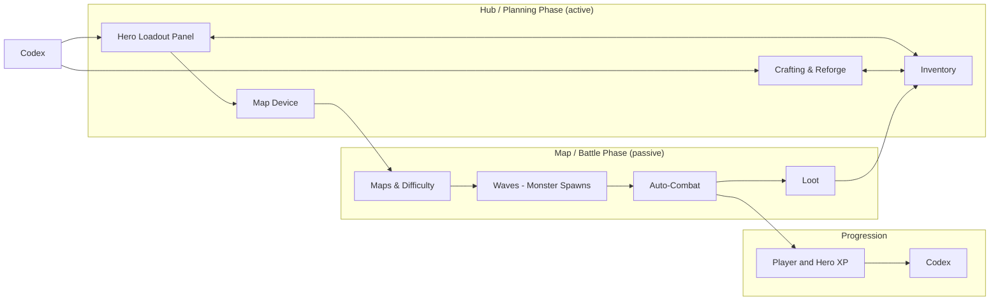
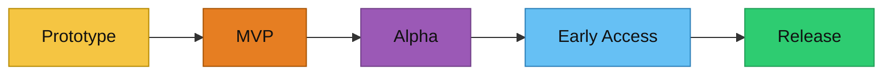

# C.H.A.L.2

    

> Auto-battler / team-builder where you play as a team architect and build alchemist.

C.H.A.L.2 (Customized Hero Arena Looter - **working title**) is a systems-driven auto-battler prototype focused on data-first design. You plan builds, craft gear, and set up hero loadouts in the hub, then watch fully automated wave battles. Progress is long-term and permanent, driven by deterministic crafting and research-based unlocks instead of pure loot lottery.

## What Makes It Different
- Build-first, no APM: combat is fully automated; skill expression is in planning and team composition.
- Deterministic crafting with controlled RNG, not a loot lottery.
- Research-gated progression that unlocks systems, heroes, items, and map tiers.
- Long-term progress is preserved; failure mainly costs the current wave's rewards.

## Highlights
- Wave- and map-based encounters with difficulty tiers.
- Hero growth via levels, skill trees, and loadout synergies.
- Deterministic crafting, reforging, and item progression.
- Loot and rarity rules designed for predictable progress.
- Hub loop that alternates focus (planning) and reward (watching).
- Data-first configs and debug tooling for fast iteration.

## Systems At A Glance

## Status
Current Status: 
#### Roadmap

## Docs
- [Handbook](docs/handbook/README.md)
- [API Docs](docs/CHAL/README.md)

## License
Proprietary. All rights reserved. See [LICENSE](LICENSE).
