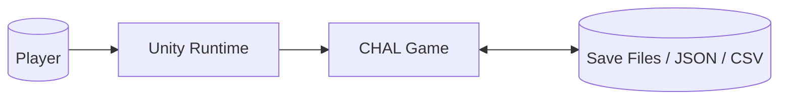
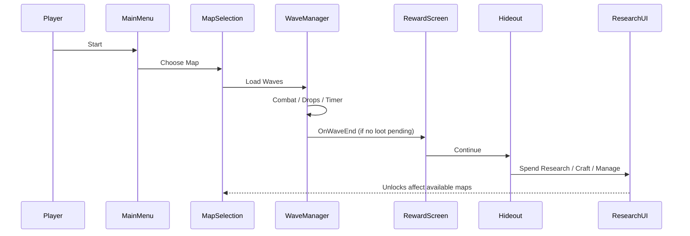
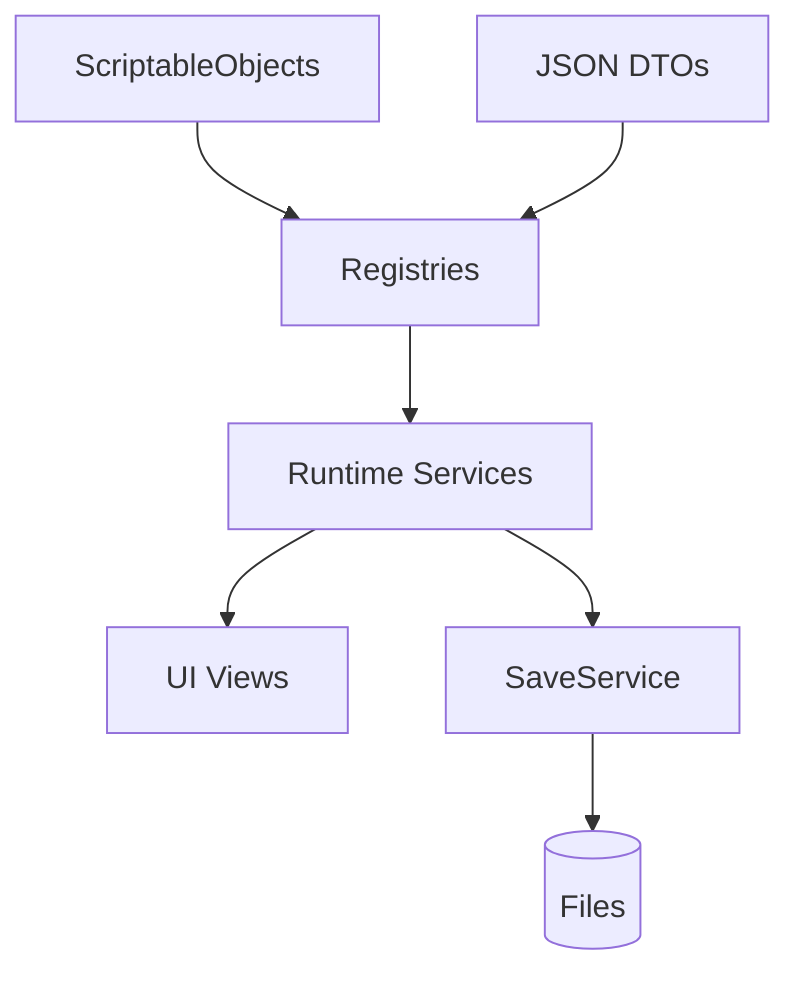

# Architecture Map

## 1) Context (C4: System Context)

## 2) High-Level Components

- Core: GameManager, SceneRouter, DebugManager
- Systems: Loot, Wave, Research, Crafting, Save, Inventory, Balance, Skills
- Data: ScriptableObjects + JSON DTOs, Registries, Validation
- UI: UI Toolkit Screens, Docking, HUD, Overlays

## 3) GameFlow (Sequence)

## 4) Events & Services

- Event flows (excerpt):
    - EnemyKilled(EnemyRank, Tags) → ResearchEventBridge → ResearchService.Progress
    - WaveCompleted → RewardService.Show → SaveService.QueueAutosave
    - ItemCrafted(ItemId) → ResearchEventBridge → ResearchService.Progress
- Services:
    - **SaveService** (persists profiles, versioning/migration)
    - **ResearchService** (node state, unlocks, progress formulas)
    - **LootService** (drops, rarity, unlucky-protection)
    - **BalanceManager** (numbers from SO/JSON, deterministic seeds)

## 5) Data Flows

## 6) Dependency Rules

- UI knows Services (via controller), not vice versa.
- Services know Registries/DTOs, not UI.
- Debug/logs only via DebugManager (see Conventions).

## 7) Extensibility

- New systems → own Service + Registry + UI Controller.
- New data → define DTO + validation + CSV report schema.
