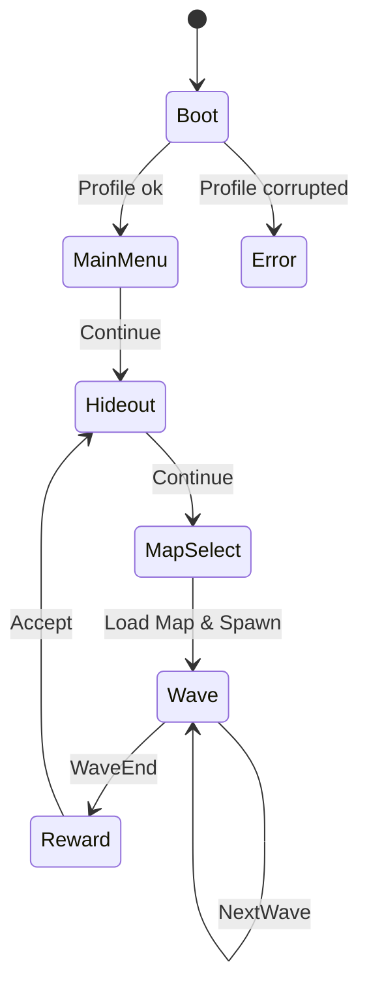

# Lifecycle & State Transitions

## State Machine (Top-Level)

```mermaid
stateDiagram-v2
  [*] --> Boot
  Boot --> MainMenu : Profile ok
  Boot --> Error : Profile corrupted

  MainMenu --> Hideout : Continue
  MapSelect --> Wave : Load Map & Spawn
  Wave --> Reward : WaveEnd
  Wave --> Wave : NextWave
  Reward --> Hideout : Accept
  Hideout --> MapSelect : Continue
```

