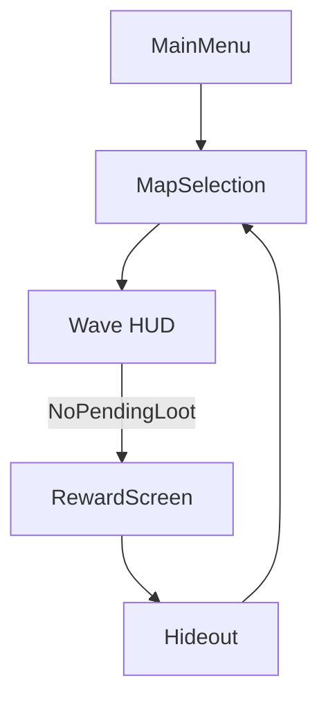

# UI Flows & Docking

## Screens & Priorities
| Screen            | Modal | Z-Order | Input Priority |
|-------------------|-------|---------|----------------|
| RewardScreen      | yes   | High    | Highest        |
| GhostOverlay      | yes   | High    | High           |
| HUD               | no    | Mid     | Medium         |
| MapSelection      | yes   | High    | High           |
| Hideout Panels    | yes   | High    | High           |
| Research UI       | yes   | High    | High           |
| MainMenu          | yes   | High    | High           |

## Visibility Rules
- RewardScreen appears only if `NoPendingLoot == true`.
- Opening a modal locks HUD interaction.
- GhostOverlay blocks interaction underneath (explicit whitelist possible).

## Docking (UIDockingManager)
- DockEdges: Left/Right/Top/Bottom; fixed slots per edge.
- Rules: only one modal per edge; focus switching via Tab/Ctrl+Tab.

## Navigation Flow (Mermaid)

