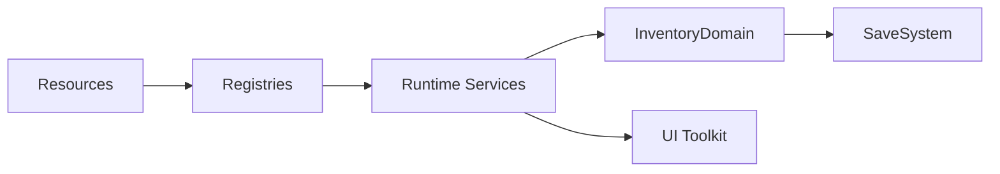

# Data Pipeline

## Sources
- Config assets: `Resources/config/*`.
- Data assets: `Resources/data/*`.

## Registries and Services
- Registries load data via `Resources.LoadAll` (items, skills, monster tags, loot rules).
- Services use registries to resolve runtime behavior.
- InventoryDomain holds live instances; GameManager snapshots them into the profile.

## References
- `Systems/Items/ItemRegistry.cs` (API: [ItemRegistry](../CHAL/Systems/Items/ItemRegistry.md))
- `Systems/Skills/SkillRegistry.cs` (API: [SkillRegistry](../CHAL/Systems/Skill/SkillRegistry.md))
- `Systems/Enemy/MonsterTagRegistry.cs` (API: [MonsterTagRegistry](../CHAL/Systems/Enemy/MonsterTagRegistry.md))
- `Systems/Loot/LootRulesService.cs` (API: [LootRulesService](../CHAL/Systems/Loot/LootRulesService.md))
- `Core/GameManager.cs` (API: [GameManager](../CHAL/Core/GameManager.md))

## Related
- [Resources and Paths](ResourcesAndPaths.md)
- [Save and Load](SaveLoad.md)
