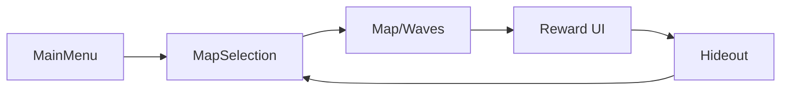

# Game Loop

## Loop Summary
MainMenu -> MapSelection -> Map (Waves) -> Reward -> Hideout -> MapSelection.

## Start New Game
- Triggered from `UI/CharacterCreationUI.cs` via `GameManager.StartNewGame`.
- Bootstraps inventory and codex, saves once, then loads `03_Hideout`.

## Continue Game
- Triggered from `UI/MainMenuUI.cs` via `GameManager.ContinueGame`.
- Loads profile and snapshots, restores domain and codex, then loads `03_Hideout`.

## Start Map
- Triggered from `UI/MapSelectionIUI.cs` via `GameManager.StartMap(sceneName, mapDef)`.
- Loads `04_Map` and spawns the WaveManager from the map prefab.

## References
- `UI/CharacterCreationUI.cs` (API: [CharacterCreationUI](../CHAL/UI/CharacterCreationUI.md))
- `UI/MainMenuUI.cs` (API: [MainMenuUI](../CHAL/UI/MainMenuUI.md))
- `UI/MapSelectionIUI.cs` (API: [MapSelectionIUI](../CHAL/UI/MapSelectionIUI.md))
- `Core/GameManager.cs` (API: [GameManager](../CHAL/Core/GameManager.md))

## Related
- [Scenes and Boot](ScenesAndBoot.md)
- [Save and Load](SaveLoad.md)
- [Map and Waves](systems/MapWave.md)
