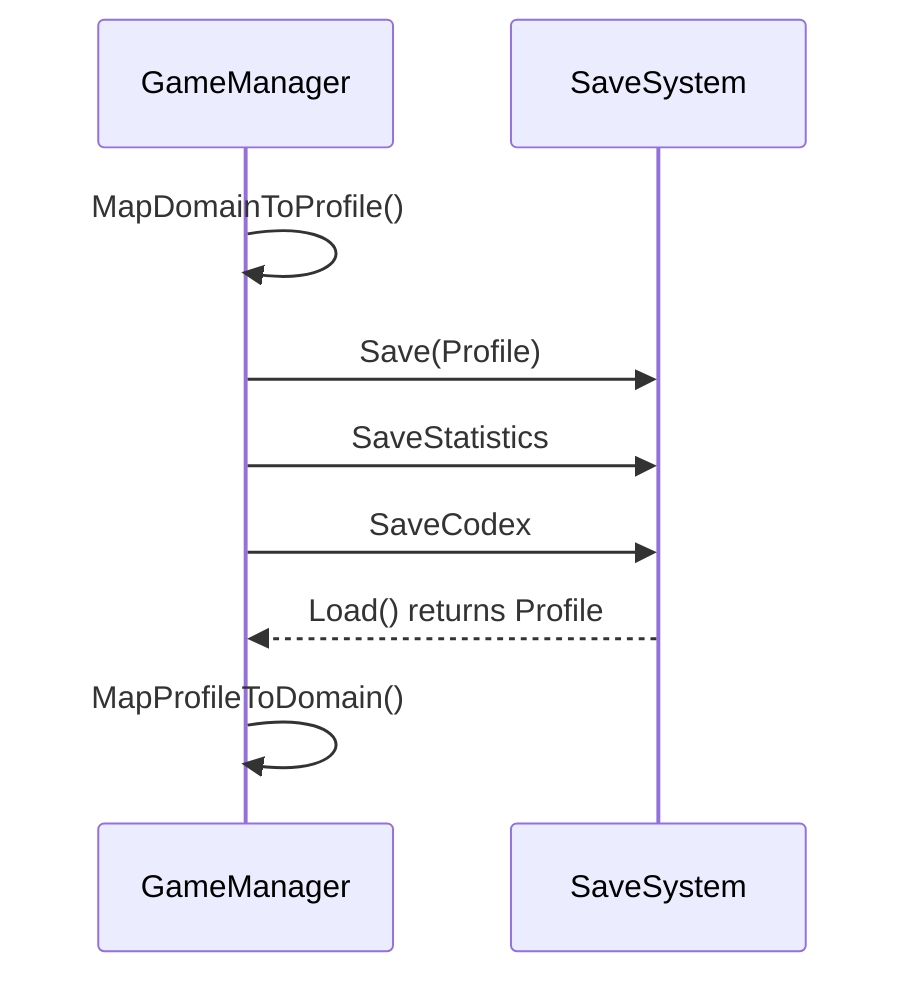

# Save and Load

## What Is Saved
- Profile JSON (base player data).
- `inventory_v1.json` (inventory snapshots).
- `codex_v1.json` (codex progress and focus slots).
- `statistics_v1.json` (counters).

## Save Flow
- `GameManager.SaveGame()` maps domain -> profile and calls `SaveSystem.Save(Profile)`.
- Stats and codex snapshots are stored via `SaveSystem.SaveStatistics` and `SaveSystem.SaveCodex`.

## Load Flow
- `SaveSystem.Load()` reads the profile and loads inventory snapshots into `Profile.InventorySave`.
- `GameManager.MapProfileToDomain()` restores instances and slots.

## References
- `Core/GameManager.cs` (API: [GameManager](../CHAL/Core/GameManager.md))
- `Core/SaveSystem.cs` (API: [SaveSystem](../CHAL/Core/SaveSystem.md))

## Related
- [Data Pipeline](DataPipeline.md)
- [Core](systems/Core.md)
