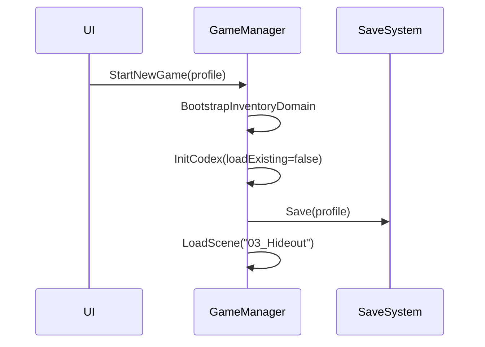

# Scenes and Boot

## Manager Presence
- `01_MainMenu.unity` includes `GameManager`.
- `03_Hideout.unity` includes `GameManager`.
- `_CraftingTest.unity` includes `GameManager`.
- `04_Map.unity` includes `MapManager` and `BalanceManager`.
- `_Combat Test.unity`, `_visualPrototype.unity`, `_ConsolePrototype.unity` include `BalanceManager`.

## Serialized References (GameManager)
- In `01_MainMenu`, `heroCatalog` and `codex` are assigned; `config` and `inputManager` are unset.
- In `03_Hideout`, `config` and `heroCatalog` are assigned; `codex` and `inputManager` are unset.

## Boot Sequence (Start New Game)

## Notes
- `WaveManager` is not a named scene root in `04_Map`. It is obtained from the map prefab at runtime by `MapManager`.

## References
- `Assets/_Scenes/01_MainMenu.unity`
- `Assets/_Scenes/03_Hideout.unity`
- `Assets/_Scenes/_CraftingTest.unity`
- `Assets/_Scenes/04_Map.unity`
- `Assets/_Scenes/_Combat Test.unity`
- `Assets/_Scenes/_visualPrototype.unity`
- `Systems/Map/MapManager.cs` (API: [MapManager](../CHAL/Systems/Map/MapManager.md))

## Related
- [Game Loop](GameLoop.md)
- [Core](systems/Core.md)
