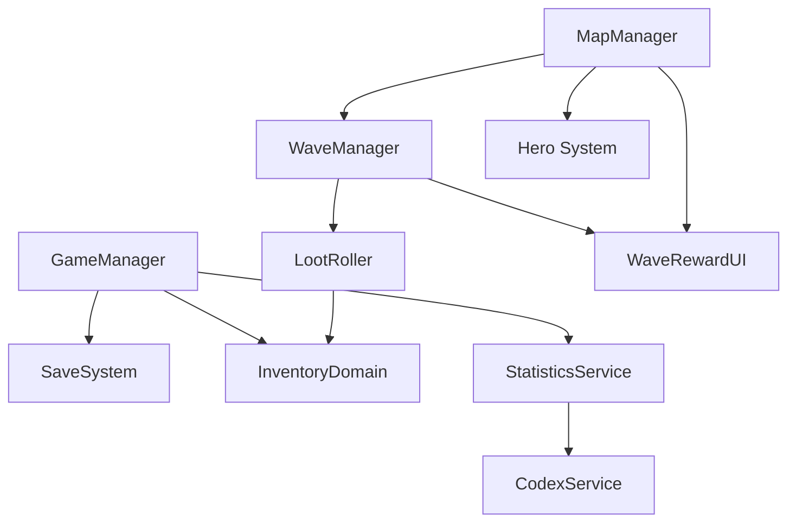

# System Map

## High-Level Dependencies
- GameManager owns profile, inventory domain, stats, and codex wiring.
- MapManager owns wave flow and reward UI.
- WaveManager owns wave execution and loot collection.
- Hero system owns runtime hero instances and loadouts for each run.
- InventoryDomain owns runtime inventory state and instances.

## References
- `Core/GameManager.cs` (API: [GameManager](../CHAL/Core/GameManager.md))
- `Core/SaveSystem.cs` (API: [SaveSystem](../CHAL/Core/SaveSystem.md))
- `Core/StatisticService.cs` (API: [StatisticService](../CHAL/Systems/Stats/StatisticService.md))
- `Systems/Map/MapManager.cs` (API: [MapManager](../CHAL/Systems/Map/MapManager.md))
- `Systems/Map/Waves/WaveManager.cs` (API: [WaveManager](../CHAL/Systems/Wave/WaveManager.md))
- `Systems/Loot/LootRoller.cs` (API: [LootRoller](../CHAL/Systems/Loot/LootRoller.md))
- `Systems/Heroes/HeroController.cs` (API: [HeroController](../CHAL/Systems/Hero/HeroController.md))

## Related
- [Data Pipeline](DataPipeline.md)
- [Scenes and Boot](ScenesAndBoot.md)
- [Handbook](README.md)
