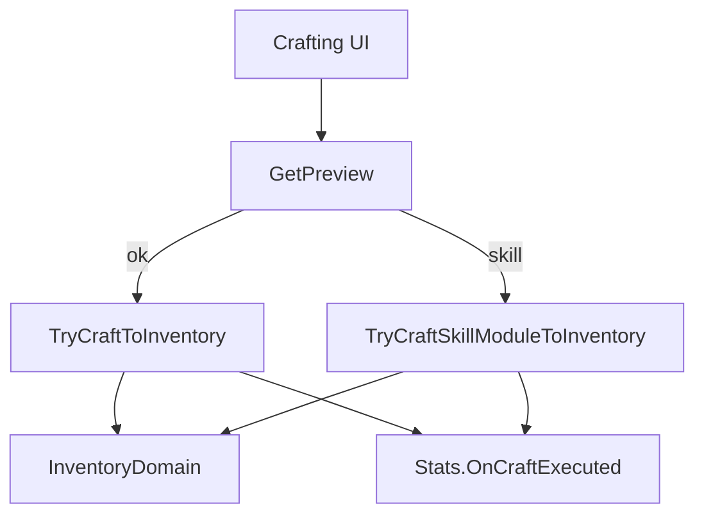

# Crafting

## Responsibilities
- Craft gear and skill modules.
- Spend materials and currency.
- Register runtime instances and emit stats events.

## Key Types
- `CraftingService`
- `CraftingController`
- `CraftingCatalog`

## Flow
- Preview validates output capacity, materials, and currency.
- Commit removes materials, spends gold, creates instance, adds to inventory.
- Stats event is emitted for codex progress.

## Gating
- Crafting UI list is gated by codex unlocks.

## References
- `Systems/Crafting/CraftingService.cs` (API: [CraftingService](../../CHAL/Systems/Crafting/CraftingService.md))
- `Systems/Crafting/CraftingController.cs` (API: [CraftingController](../../CHAL/Systems/Crafting/CraftingController.md))

## Related
- [Inventory](Inventory.md)
- [Research and Codex](ResearchCodex.md)
