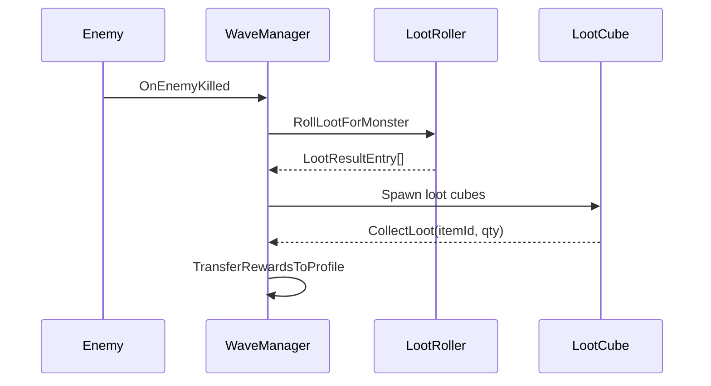

# Loot

## Responsibilities
- Load tag-based loot rules.
- Roll drops with rarity, budget, and unlucky protection.
- Support secret drops and wave guarantees.

## Key Types
- `LootRulesService`
- `LootRoller`
- `UnluckyProtection`
- `LootCube`

## Data Sources
- `Resources/data/LootRules`
- `Resources/data/LootComboRules`

## Flow
- Enemy kill -> LootRoller -> LootCube spawn.
- Loot collected -> WaveRewards -> TransferRewards to profile.

## References
- `Systems/Loot/LootRulesService.cs` (API: [LootRulesService](../../CHAL/Systems/Loot/LootRulesService.md))
- `Systems/Loot/LootRoller.cs` (API: [LootRoller](../../CHAL/Systems/Loot/LootRoller.md))
- `Systems/Loot/UnluckyProtection.cs` (API: [UnluckyProtection](../../CHAL/Systems/Loot/UnluckyProtection.md))
- `Systems/Map/Waves/WaveManager.cs` (API: [WaveManager](../../CHAL/Systems/Wave/WaveManager.md))

## Related
- [Map and Waves](MapWave.md)
- [Resources and Paths](../ResourcesAndPaths.md)
