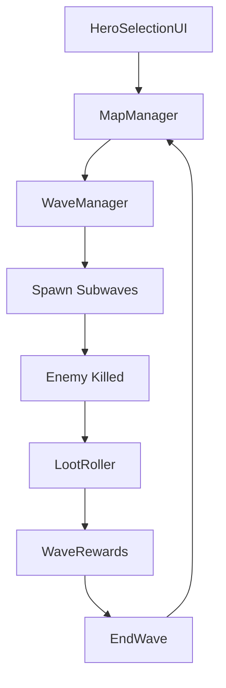

# Map and Waves

## Responsibilities
- Manage map progression and wave execution.
- Drive loot, rewards, and stats events.
- Show reward UI on wave or map completion.

## Key Types
- `MapManager`
- `WaveManager`
- `WaveComposition`

## Flow
- MapManager loads map prefab and finds WaveManager.
- HeroSelectionUI selects a team and passes hero IDs into MapManager.
- MapManager spawns selected heroes at wave spawn points.
- WaveManager spawns subwaves and listens for enemy kills.
- WaveManager finalizes rewards and calls MapManager.OnWaveCompleted.

## Data Sources
- `Resources/data/Map` (MapDef and WaveDef assets).

## References
- `Systems/Map/MapManager.cs` (API: [MapManager](../../CHAL/Systems/Map/MapManager.md))
- `Systems/Map/Waves/WaveManager.cs` (API: [WaveManager](../../CHAL/Systems/Wave/WaveManager.md))
- `UI/HeroSelectionUI.cs` (API: [HeroSelectionUI](../../CHAL/UI/HeroSelectionUI.md))

## Related
- [Game Loop](../GameLoop.md)
- [Loot](Loot.md)
- [Heroes and Loadouts](Heroes.md)
- [UI](UI.md)
