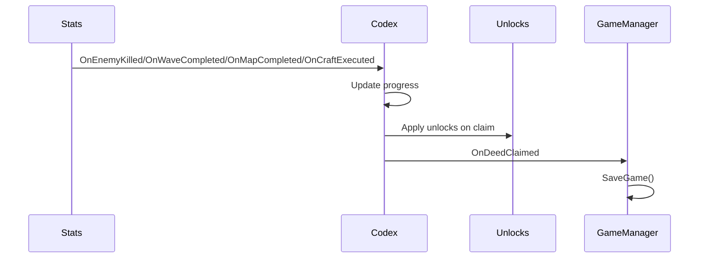

# Research and Codex

## Responsibilities
- Track deeds and focus slots.
- Apply unlocks and coupons on claim.
- Persist codex progress between sessions.

## Key Types
- `CodexService`
- `CodexGateEngine`
- `CodexUnlockRegistry`
- `CodexSnapshot`

## Flow
- Stats events -> codex progress.
- Claim -> unlocks + coupons -> save.

## Data Sources
- `Resources/data/Codex`
- `Resources/data/Codex/Deeds`

## References
- `Systems/Research/CodexService.cs` (API: [CodexService](../../CHAL/Systems/Research/CodexService.md))
- `Systems/Research/CodexSnapshot.cs` (API: [CodexSnapshot](../../CHAL/Systems/Research/CodexSnapshot.md))
- `Core/GameManager.cs` (API: [GameManager](../../CHAL/Core/GameManager.md))

## Related
- [Core](Core.md)
- [Save and Load](../SaveLoad.md)
