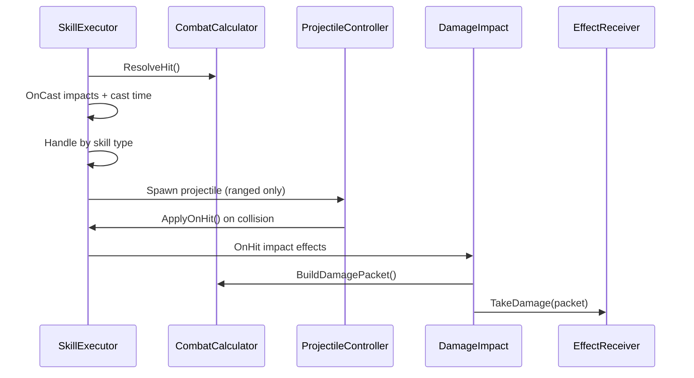

# Skills and Combat

## Responsibilities
- Execute skills and resolve hits.
- Apply damage, resistances, and status effects.
- Provide a single mitigation pipeline via EffectReceiver.

## Where SkillInstances Come From
- `HeroController.RebuildSocketedSkills()` builds the runtime skill list for each hero.
- Fallback attacks come from `HeroDef.fallBackAttack`.
- Module-based skills are created from `debugSocketSkills` and resolved via `SkillRegistry`.
- There is not yet a live bridge from hero socket inventories to SkillInstances (but planned in near future).

## Execution Pipeline (Runtime)
- `SkillInstance` recalculates final values (damage, range, cast time, cooldown, projectile stats) using module data and modifiers.
- `SkillExecutor.ExecuteSkill` resolves a hit, triggers OnCast effects, applies cast-time hook, then dispatches by skill type.
- Melee and Spell call `ApplyOnHit`, which triggers OnHit effects.
- Ranged spawns a `ProjectileController` that calls `ApplyOnHit` on collision.
- Actual damage is applied by effects such as `DamageImpact`, which builds a `DamagePacket` and calls `EffectReceiver.TakeDamage`.

## Hit Resolution
- `CombatCalculator.Resolve` creates a `HitContext` and returns a `HitResult`.
- V1 defaults to always hit, no crit. Accuracy/evasion/crit are placeholders.

## Damage and Mitigation
- `CombatCalculator.BuildDamagePacket` produces per-type damage with crit multiplier.
- `EffectReceiver` applies mitigation:
- Physical damage uses armor-based reduction.
- Non-physical damage uses a shared elemental resist value (V1).
- A damage-taken multiplier is applied after type mitigation.
- Barrier is a TODO and currently not implemented.

## Status Effects
- `EffectReceiver.ApplyStatusEffect` handles DoT, Buff, and Debuff stacking and refresh.
- Buffs and debuffs add/remove modifiers in `ModifierStack`.
- `UpdateEffects` ticks DoT damage via `DamagePacket` and removes expired effects.

## Key Types
- `SkillInstance`
- `SkillExecutor`
- `CombatCalculator`
- `HitContext` and `HitResult`
- `DamagePacket`
- `ProjectileController`
- `EffectReceiver`
- `ModifierStack`
- `ActiveStatusEffect`, `DoTStatusEffect`, `BuffStatusEffect`, `DebuffStatusEffect`

## Known Limitations (Current Code)
- Hit resolution has no real accuracy/evasion/crit stats yet.
- Ranged projectiles are spawned as new GameObjects (no pooling).
- Elemental resistance is shared and defaults to 0 unless overridden.

## References
- `Systems/Heroes/HeroController.cs` (API: [HeroController](../../CHAL/Systems/Hero/HeroController.md))
- `Systems/Skills/SkillInstance.cs` (API: [SkillInstance](../../CHAL/Systems/Skill/SkillInstance.md))
- `Systems/Skills/SkillExecuter.cs` (API: [SkillExecuter](../../CHAL/Systems/Skill/SkillExecuter.md))
- `Systems/Skills/CombatCalculator.cs` (API: [CombatCalculator](../../CHAL/Systems/Skill/CombatCalculator.md))
- `Systems/Skills/HitContext.cs` (API: [HitContext](../../CHAL/Systems/Skill/HitContext.md))
- `Systems/Skills/DamagePacket.cs` (API: [DamagePacket](../../CHAL/Systems/Skill/DamagePacket.md))
- `Systems/Skills/ProjectileController.cs` (API: [ProjectileController](../../CHAL/Systems/Skill/ProjectileController.md))
- `Systems/Skills/Effekte/DamageImpact.cs` (API: [DamageImpact](../../CHAL/Systems/Skill/DamageImpact.md))
- `Systems/Skills/SkillModifierStack.cs` (API: [SkillModifierStack](../../CHAL/Systems/Skill/SkillModifierStack.md))
- `Systems/Unit/EffectReceiver.cs` (API: [EffectReceiver](../../CHAL/Systems/Unit/EffectReceiver.md))
- `Systems/Skills/ActiveStatusEffect.cs` (API: [ActiveStatusEffect](../../CHAL/Systems/Skill/ActiveStatusEffect.md))
- `Systems/Skills/DoTStatusEffect.cs` (API: [DoTStatusEffect](../../CHAL/Systems/Skill/DoTStatusEffect.md))
- `Systems/Skills/BuffStatusEffect.cs` (API: [BuffStatusEffect](../../CHAL/Systems/Skill/BuffStatusEffect.md))
- `Systems/Skills/DebuffStatusEffect.cs` (API: [DebuffStatusEffect](../../CHAL/Systems/Skill/DebuffStatusEffect.md))

## Related
- [Heroes and Loadouts](Heroes.md)
- [System Map](../SystemMap.md)
- [Design vs Implementation](../DesignVsImplementation.md)
